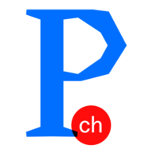
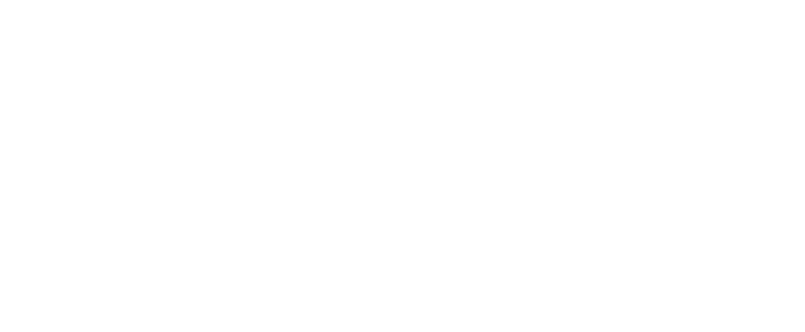

# 🤝 Our Supporters

**ExoDAO has been funded through a grant from the Prototype Fund Switzerland (Opendata.ch/Mercator Foundation) with support from the Student Project House of the Swiss Federal Institute of Technology in Zurich (SPH-ETH). It builds upon a number of technologies which themselves have recieved generous grants from a number of institutions (including the European Union).**

## Prototype Fund CH

<figure><figcaption></figcaption></figure>



## ETH Student Project House

<figure><figcaption></figcaption></figure>


